# Impact Graph — Musculoskeletal ROM Platform

> **Living document.** Update this graph every time you modify code, add files, or change documentation.
> AI agents: read this to understand ripple effects before and after any change.

---

## How to Use This Document

1. **Before coding:** Find the node you're about to change → follow all outgoing arrows → those are the files/areas you must also review or update.
2. **After coding:** Update the relevant subgraph below to reflect any new dependencies, removed links, or added nodes.
3. **On every PR:** Verify this graph still matches reality. If you added/removed imports, routes, or schema fields — update here.

---

## Master Dependency Graph

```mermaid
flowchart TB
    %% ============================================================
    %% DOMAIN CONTRACTS (source of truth)
    %% ============================================================
    subgraph SHARED["packages/shared-types"]
        direction TB
        ST_IDX["index.ts<br/>barrel exports"]
        ST_SESSION["session.ts<br/>Session, CreateSession"]
        ST_MEAS["measurement.ts<br/>Measurement, CreateMeasurement"]
        ST_NOTE["note.ts<br/>Note, NoteBlock"]
        ST_AUDIT["audit.ts<br/>AuditEvent, AuditAction"]
        ST_USER["user.ts<br/>User, UserRole"]
        ST_IDX --> ST_SESSION & ST_MEAS & ST_NOTE & ST_AUDIT & ST_USER
    end

    %% ============================================================
    %% API SERVER
    %% ============================================================
    subgraph API["apps/api"]
        direction TB

        subgraph API_ENTRY["Entrypoints"]
            APP_TS["app.ts<br/>Express wiring"]
            SERVER_TS["server.ts"]
            SERVER_TS --> APP_TS
        end

        subgraph API_AUTH["Auth"]
            JWT_TS["auth/jwt.ts<br/>sign, verify, hash"]
        end

        subgraph API_MW["Middleware"]
            MW_AUTHZ["middleware/authz.ts<br/>requireAuth, requireRole"]
            MW_RATE["middleware/rate-limit.ts"]
            MW_SEC["middleware/security-headers.ts"]
            MW_LOG["middleware/request-logger.ts"]
        end

        subgraph API_REPO["Repositories"]
            REPO_SESSION["repositories/session-repo.ts"]
            REPO_MEAS["repositories/measurement-repo.ts"]
            REPO_AUDIT["repositories/audit-repo.ts"]
        end

        subgraph API_SVC["Services"]
            SVC_NOTE["services/note-builder.ts"]
            SVC_AUDIT["services/audit-log.ts"]
        end

        subgraph API_OBS["Observability"]
            OBS_LOG["observability/logger.ts"]
            OBS_METRICS["observability/metrics.ts"]
        end

        subgraph API_ROUTES["Routes"]
            RT_HEALTH["routes/health.ts"]
            RT_AUTH["routes/auth.ts"]
            RT_SESSIONS["routes/sessions.ts"]
            RT_MEAS["routes/measurements.ts"]
            RT_NOTES["routes/notes.ts"]
            RT_EXPORT["routes/export.ts"]
        end

        %% app.ts wires everything
        APP_TS --> MW_AUTHZ & MW_RATE & MW_SEC & MW_LOG
        APP_TS --> RT_HEALTH & RT_AUTH & RT_SESSIONS & RT_MEAS & RT_NOTES & RT_EXPORT
        APP_TS --> OBS_LOG

        %% Route dependencies
        RT_AUTH --> JWT_TS
        RT_SESSIONS --> MW_AUTHZ & REPO_SESSION
        RT_MEAS --> MW_AUTHZ & REPO_MEAS & REPO_SESSION
        RT_NOTES --> MW_AUTHZ & REPO_SESSION & REPO_MEAS & SVC_NOTE
        RT_EXPORT --> MW_AUTHZ & SVC_NOTE & REPO_SESSION & SVC_AUDIT
        RT_HEALTH --> OBS_METRICS

        %% Middleware dependencies
        MW_AUTHZ --> JWT_TS
    end

    %% ============================================================
    %% WEB FRONTEND
    %% ============================================================
    subgraph WEB["apps/web"]
        direction TB

        subgraph WEB_LAYOUT["Layout"]
            WEB_ROOT_LAYOUT["app/layout.tsx"]
            WEB_SIDEBAR["components/layout/Sidebar.tsx"]
            WEB_TOPBAR["components/layout/TopBar.tsx"]
            WEB_ROOT_LAYOUT --> WEB_SIDEBAR & WEB_TOPBAR
        end

        subgraph WEB_PAGES["Pages"]
            WEB_DASHBOARD["app/page.tsx<br/>Dashboard"]
            WEB_NEW_SESSION["app/sessions/new/page.tsx"]
        end

        subgraph WEB_CAPTURE["Capture Components"]
            WEB_CAMERA["components/capture/CameraSetupWizard.tsx"]
            WEB_PANEL["components/capture/MeasurementPanel.tsx"]
        end

        subgraph WEB_NOTES["Note Components"]
            WEB_EDITOR["components/notes/NoteEditor.tsx"]
        end

        WEB_NEW_SESSION --> WEB_CAMERA & WEB_PANEL & WEB_EDITOR
    end

    %% ============================================================
    %% CV SERVICE
    %% ============================================================
    subgraph CV["services/cv"]
        direction TB
        CV_MAIN["app/main.py<br/>FastAPI app"]
        CV_SCHEMAS["app/schemas.py<br/>Pydantic models"]
        CV_PIPELINE["app/pipeline.py<br/>angle computation"]
        CV_RT_PIPE["app/routes/pipeline.py"]
        CV_RT_HEALTH["app/routes/health.py"]

        CV_MAIN --> CV_RT_PIPE & CV_RT_HEALTH
        CV_RT_PIPE --> CV_SCHEMAS & CV_PIPELINE
        CV_PIPELINE --> CV_SCHEMAS
    end

    %% ============================================================
    %% NLP SERVICE
    %% ============================================================
    subgraph NLP["services/nlp"]
        direction TB
        NLP_MAIN["app/main.py<br/>Skeleton"]
    end

    %% ============================================================
    %% BUILD SYSTEM
    %% ============================================================
    subgraph BUILD["Build Config"]
        direction TB
        TURBO["turbo.json"]
        PNPM_WS["pnpm-workspace.yaml"]
        ROOT_PKG["package.json (root)"]
        TS_BASE["tsconfig.base.json"]
    end

    %% ============================================================
    %% DOCUMENTATION
    %% ============================================================
    subgraph DOCS["docs/"]
        direction TB
        DOC_PRD["planning-v2/02-prd.md"]
        DOC_ARCH["planning-v2/03-architecture.md"]
        DOC_CV["planning-v2/04-ai-cv-design.md"]
        DOC_SEC["planning-v2/05-security.md"]
        DOC_ROADMAP["planning-v2/08-roadmap.md"]
        DOC_TEST["planning-v2/09-test-plan.md"]
        DOC_BACKLOG["planning-v2/10-backlog.md"]
        DOC_THREAT["security/THREAT_MODEL_V1.md"]
    end

    subgraph META["Project Meta"]
        direction TB
        AI_CTX["AI_CONTEXT.md"]
        PROGRESS["progress.md"]
        IMPACT["IMPACT_GRAPH.md (this file)"]
    end

    %% ============================================================
    %% CROSS-PACKAGE EDGES
    %% ============================================================

    %% shared-types → consumers (declared dep, not yet imported in code)
    SHARED -.->|"declared dep<br/>not yet imported"| API
    SHARED -.->|"declared dep<br/>not yet imported"| WEB

    %% CV schemas mirror shared-types (structural, no import)
    ST_MEAS -.->|"structural mirror<br/>schema drift risk"| CV_SCHEMAS

    %% Build chain
    TURBO -->|"^build dependency"| SHARED
    SHARED -->|"builds before"| API
    SHARED -->|"builds before"| WEB
    TS_BASE -->|"extends"| API
    TS_BASE -->|"extends"| WEB
    TS_BASE -->|"extends"| SHARED

    %% Docs reference code
    DOC_PRD -.->|"references"| API_ROUTES & WEB_PAGES
    DOC_ARCH -.->|"references"| API & WEB & CV & NLP
    DOC_CV -.->|"references"| CV_PIPELINE & CV_SCHEMAS
    DOC_SEC -.->|"references"| API_MW & API_AUTH
    DOC_ROADMAP -.->|"references"| API & WEB & CV & NLP
    DOC_TEST -.->|"references"| API & WEB & CV

    %% Meta docs reference everything
    AI_CTX -.->|"summarizes"| API & WEB & CV & NLP & SHARED & DOCS
    PROGRESS -.->|"tracks"| API & WEB & CV & NLP & SHARED

    %% ============================================================
    %% STYLES
    %% ============================================================
    classDef schema fill:#4a9eff,stroke:#2563eb,color:#fff
    classDef api fill:#10b981,stroke:#059669,color:#fff
    classDef web fill:#f59e0b,stroke:#d97706,color:#fff
    classDef cv fill:#8b5cf6,stroke:#7c3aed,color:#fff
    classDef nlp fill:#ec4899,stroke:#db2777,color:#fff
    classDef config fill:#6b7280,stroke:#4b5563,color:#fff
    classDef doc fill:#94a3b8,stroke:#64748b,color:#000
    classDef meta fill:#f43f5e,stroke:#e11d48,color:#fff

    class ST_IDX,ST_SESSION,ST_MEAS,ST_NOTE,ST_AUDIT,ST_USER schema
    class APP_TS,SERVER_TS,JWT_TS,MW_AUTHZ,MW_RATE,MW_SEC,MW_LOG,REPO_SESSION,REPO_MEAS,REPO_AUDIT,SVC_NOTE,SVC_AUDIT,OBS_LOG,OBS_METRICS,RT_HEALTH,RT_AUTH,RT_SESSIONS,RT_MEAS,RT_NOTES,RT_EXPORT api
    class WEB_ROOT_LAYOUT,WEB_SIDEBAR,WEB_TOPBAR,WEB_DASHBOARD,WEB_NEW_SESSION,WEB_CAMERA,WEB_PANEL,WEB_EDITOR web
    class CV_MAIN,CV_SCHEMAS,CV_PIPELINE,CV_RT_PIPE,CV_RT_HEALTH cv
    class NLP_MAIN nlp
    class TURBO,PNPM_WS,ROOT_PKG,TS_BASE config
    class DOC_PRD,DOC_ARCH,DOC_CV,DOC_SEC,DOC_ROADMAP,DOC_TEST,DOC_BACKLOG,DOC_THREAT doc
    class AI_CTX,PROGRESS,IMPACT meta
```

---

## Impact Lookup Tables

Use these tables for quick "what else must I update?" lookups.

### When You Change a Shared Type Schema

| Changed File | Must Also Review/Update |
|---|---|
| `shared-types/src/session.ts` | `api/routes/sessions.ts`, `api/repositories/session-repo.ts`, `api/services/note-builder.ts`, `cv/app/schemas.py` (mirror), `web/` (when integrated), `AI_CONTEXT.md` §4, docs `02-prd.md` |
| `shared-types/src/measurement.ts` | `api/routes/measurements.ts`, `api/repositories/measurement-repo.ts`, `api/services/note-builder.ts`, `cv/app/schemas.py` (mirror), `cv/app/pipeline.py`, `web/` (when integrated), `AI_CONTEXT.md` §4, docs `04-ai-cv-design.md` |
| `shared-types/src/note.ts` | `api/routes/notes.ts`, `api/routes/export.ts`, `api/services/note-builder.ts`, `web/components/notes/NoteEditor.tsx`, `AI_CONTEXT.md` §4 |
| `shared-types/src/audit.ts` | `api/services/audit-log.ts`, `api/routes/export.ts`, `AI_CONTEXT.md` §4, docs `05-security.md` |
| `shared-types/src/user.ts` | `api/auth/jwt.ts`, `api/middleware/authz.ts`, `api/routes/auth.ts`, `AI_CONTEXT.md` §4 |
| `shared-types/src/index.ts` | All of the above — barrel re-exports trigger rebuild of all dependents |

### When You Change an API Route

| Changed File | Must Also Review/Update |
|---|---|
| `api/routes/auth.ts` | `api/auth/jwt.ts`, `api/__tests__/` auth tests, `AI_CONTEXT.md` §5 |
| `api/routes/sessions.ts` | `api/repositories/session-repo.ts`, `api/middleware/authz.ts`, session tests, `AI_CONTEXT.md` §5 |
| `api/routes/measurements.ts` | `api/repositories/measurement-repo.ts`, `api/repositories/session-repo.ts`, measurement tests, `AI_CONTEXT.md` §5 |
| `api/routes/notes.ts` | `api/services/note-builder.ts`, `api/repositories/session-repo.ts`, `api/repositories/measurement-repo.ts`, note tests, `AI_CONTEXT.md` §5 |
| `api/routes/export.ts` | `api/services/note-builder.ts`, `api/services/audit-log.ts`, export tests, `AI_CONTEXT.md` §5 |
| `api/routes/health.ts` | `api/observability/metrics.ts`, health tests, `AI_CONTEXT.md` §5 |

### When You Change a Repository

| Changed File | Must Also Review/Update |
|---|---|
| `api/repositories/session-repo.ts` | `api/routes/sessions.ts`, `api/routes/measurements.ts`, `api/routes/notes.ts`, `api/routes/export.ts`, all tests that call `_clearSessions()` |
| `api/repositories/measurement-repo.ts` | `api/routes/measurements.ts`, `api/routes/notes.ts`, all tests that call `_clearMeasurements()` |
| `api/repositories/audit-repo.ts` | `api/services/audit-log.ts` (if used) |

### When You Change Middleware

| Changed File | Must Also Review/Update |
|---|---|
| `api/middleware/authz.ts` | `api/auth/jwt.ts` (it imports verifyToken), ALL protected routes (sessions, measurements, notes, export), auth tests, `AI_CONTEXT.md` §5 & §8 |
| `api/middleware/rate-limit.ts` | `api/app.ts`, security tests, `AI_CONTEXT.md` §8, docs `05-security.md` |
| `api/middleware/security-headers.ts` | `api/app.ts`, security tests, `AI_CONTEXT.md` §8, docs `05-security.md`, `THREAT_MODEL_V1.md` |

### When You Change the CV Pipeline

| Changed File | Must Also Review/Update |
|---|---|
| `cv/app/schemas.py` | `cv/app/pipeline.py`, `cv/app/routes/pipeline.py`, `cv/tests/test_pipeline.py`, `shared-types/measurement.ts` (keep in sync), `AI_CONTEXT.md` §6, docs `04-ai-cv-design.md` |
| `cv/app/pipeline.py` | `cv/app/routes/pipeline.py`, `cv/tests/test_pipeline.py`, `AI_CONTEXT.md` §6, docs `04-ai-cv-design.md` |
| `cv/app/main.py` | `cv/app/routes/` (all registered routers), `cv/pyproject.toml` |

### When You Change Frontend Components

| Changed File | Must Also Review/Update |
|---|---|
| `web/components/capture/CameraSetupWizard.tsx` | `web/app/sessions/new/page.tsx`, capture tests, `AI_CONTEXT.md` §7 |
| `web/components/capture/MeasurementPanel.tsx` | `web/app/sessions/new/page.tsx`, capture tests, `AI_CONTEXT.md` §7 |
| `web/components/notes/NoteEditor.tsx` | `web/app/sessions/new/page.tsx`, capture tests, `AI_CONTEXT.md` §7 |
| `web/components/layout/Sidebar.tsx` | `web/app/layout.tsx`, `AI_CONTEXT.md` §7 |
| `web/components/layout/TopBar.tsx` | `web/app/layout.tsx`, `AI_CONTEXT.md` §7 |
| `web/app/layout.tsx` | All pages (wraps everything), `AI_CONTEXT.md` §7 |
| `web/app/page.tsx` | Standalone — only update `AI_CONTEXT.md` §7 if functionality changes |
| `web/app/sessions/new/page.tsx` | All capture/note components it imports, `AI_CONTEXT.md` §7 |

### When You Change Build Config

| Changed File | Must Also Review/Update |
|---|---|
| `turbo.json` | All packages (build order may change), `AI_CONTEXT.md` §3 |
| `pnpm-workspace.yaml` | Package discovery — affects what `pnpm install` resolves |
| `tsconfig.base.json` | All TS packages that extend it (`api`, `web`, `shared-types`) |
| `package.json` (root) | Dev tooling, root scripts, `AI_CONTEXT.md` §10 |
| Any `package.json` (child) | That package's build + its dependents in Turbo graph |

### When You Update Documentation

| Changed Doc | Must Also Review/Update |
|---|---|
| `AI_CONTEXT.md` | `IMPACT_GRAPH.md` if structure changed |
| `progress.md` | `AI_CONTEXT.md` §9 (current state) |
| `docs/planning-v2/02-prd.md` | `AI_CONTEXT.md` §2 (scope) |
| `docs/planning-v2/03-architecture.md` | `AI_CONTEXT.md` §3 (architecture) |
| `docs/planning-v2/05-security.md` | `AI_CONTEXT.md` §8 (security), `THREAT_MODEL_V1.md` |
| `docs/security/THREAT_MODEL_V1.md` | `AI_CONTEXT.md` §8, docs `05-security.md` |

---

## Critical Hotspots

These files have the **highest fan-out** — changes here ripple furthest:

| Rank | File | Fan-Out | Why |
|------|------|---------|-----|
| 🔴 1 | `apps/api/src/app.ts` | 9+ imports | Wires ALL middleware + ALL routes + logger. Any structural change here breaks the entire API. |
| 🔴 2 | `packages/shared-types/src/index.ts` | 5 re-exports | Barrel file — triggers rebuild of all TS dependents. |
| 🟡 3 | `apps/api/src/middleware/authz.ts` | Used by 5 routes | Auth gateway — changes affect every protected endpoint. |
| 🟡 4 | `apps/api/src/repositories/session-repo.ts` | Used by 4 routes | Core data access — sessions, measurements, notes, export all depend on it. |
| 🟡 5 | `apps/api/src/services/note-builder.ts` | Used by 2 routes | Note generation logic — notes + export routes depend on it. |
| 🟡 6 | `cv/app/schemas.py` | Used by 3 files | CV Pydantic models — pipeline + route + tests all import it. |
| 🟢 7 | `apps/web/src/app/sessions/new/page.tsx` | Imports 3 components | Session creation page — imports wizard, panel, editor. |

---

## Schema Drift Risk Zones

These areas define the same concepts independently and can drift out of sync:

| TypeScript (shared-types) | Python (CV service) | Drift Risk |
|---|---|---|
| `MeasurementSchema` fields | `MeasurementRequest` / `MeasurementResponse` fields | 🔴 HIGH — no automated sync |
| `QualityFlagSchema` | `QualityFlag` Pydantic model | 🟡 MEDIUM |
| `Session.joints[]` allowed values | `MeasurementRequest.joint` allowed values | 🟡 MEDIUM |
| `Measurement.movement` enum values | `MeasurementRequest.movement` allowed values | 🟡 MEDIUM |

**Mitigation:** When changing measurement-related schemas in either language, always update the counterpart and run both `pnpm test` and `pytest`.

---

## Orphans & Dead Code

| File | Status | Action Needed |
|---|---|---|
| `api/repositories/audit-repo.ts` | Never imported | Wire into `audit-log.ts` service or remove |
| `@rom/shared-types` imports in `api` | Declared in package.json but zero import statements | Actually import from shared-types OR remove the dependency |
| `@rom/shared-types` imports in `web` | Declared in package.json + next.config.js transpile but zero imports | Same as above |
| `next.config.js` transpilePackages | Configured for `@rom/shared-types` but package not imported | Remove config or add actual imports |

---

## Update Protocol

**Every time you complete a code change:**

1. Check the Impact Lookup Table above for your changed file
2. Review/update all listed dependent files
3. If you added a new file or dependency arrow → add it to the Mermaid graph above
4. If you removed a file or dependency → remove it from the graph
5. If you changed the API surface → update `AI_CONTEXT.md` §5
6. If you changed schemas → update `AI_CONTEXT.md` §4
7. Run `pnpm test` to verify no regressions
8. Update `progress.md` with what you did

**When adding a brand new file:**
- Add the node to the appropriate subgraph in the Mermaid diagram
- Add edges showing what it imports and what imports it
- Add a row to the relevant Impact Lookup Table
- Apply the correct classDef style

**When wiring shared-types into actual imports (resolving the dotted-line debt):**
- Change the `-.->` dotted edge to `-->` solid edge in the graph
- Remove the corresponding row from the Orphans table
- Update the Impact Lookup Tables to reflect the new real dependency
